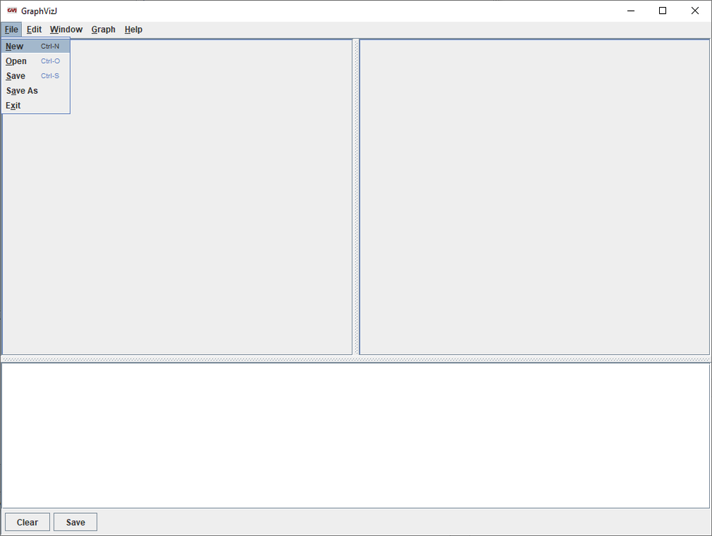

# GraphVizJ #
I like to use DOT to create diagrams of all sorts. But the GraphViz editor was really 
getting on my nerves. It is a very basic program. So I decided to write my
own tool in Java. It is based on the GraphViz editor because that is what I was getting
used to, but with all the things that were irritating me improved, replaced or
enhanced.

It is a work in progress, but already I quite enjoy using it because it is quick
and does exactly what I want and expect (most of the time).

### Quick Start ###

GraphVizJ is written in Java (hence the 'J' at the end of GraphViz). Thus, 
you would need a Java Runtime Engine installed on your computer. I have been 
compiling with SDK version 1.8 language level 8.

You need to have GraphViz installed because GraphVizJ is merely a GUI frontend for the dot language.
So download and install GraphViz from [graphviz.org](http://graphviz.org)

Before running GraphVizJ for the first time you need to tell it where the dot executable has been 
installed. There should be a file called system.properties in the installation directory. Make sure
there is a property `executable` in the file with the path to the dot executable. For example for
Windows it would be something like this:

`executable=C:/Program Files (x86)/Graphviz2.38/bin/dot.exe`

Note that the backslases have been replaced by forward slashes. If you want to use backslashes
you have to escape them, i.e. you have to use double backslashes:

`executable=C:\\Program Files (x86)\\Graphviz2.38\\bin\\dot.exe`

I discovered a problem with the Windows version of the dot language. It does not render a cylinder. 
But if you use the cygwin version of the program it does render it properly. You can use the 
cygwin version of the dot executable with something like this:

`executable=C\:\\cygwin64\\bin\\dot`

If you create a jar (called GraphVizJ.jar) or download the jar from this repository, then all you need
to do to run the program is type the following on the command line:

`javaw -cp GraphVizJ.jar com.jannetta.graphvizj.GraphVizJ`

I created a batch file so that I don't have to type this everytime. Eventually, when I get around to
it, I'll start creating Windows installation files to make things easier.

The following image shows the opening screen:

To create a new file select `File` from the menu and then `New`:

In the left hand pane you should now have an editing window:

The right hand pane is where the graph will be rendered. Type your dot code into the left pane and
then eith press Control-S or F5 to render the graph on the right hand side:

The panel at the bottom of the screen is a console and any errors produced by the dot executable 
should be displayed there.
